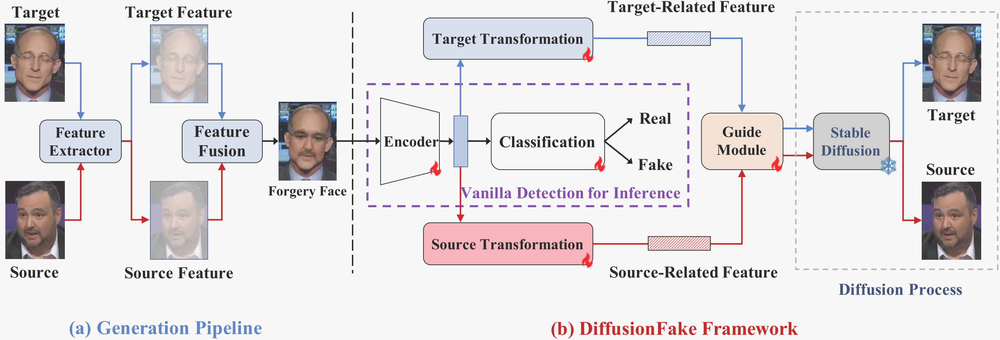
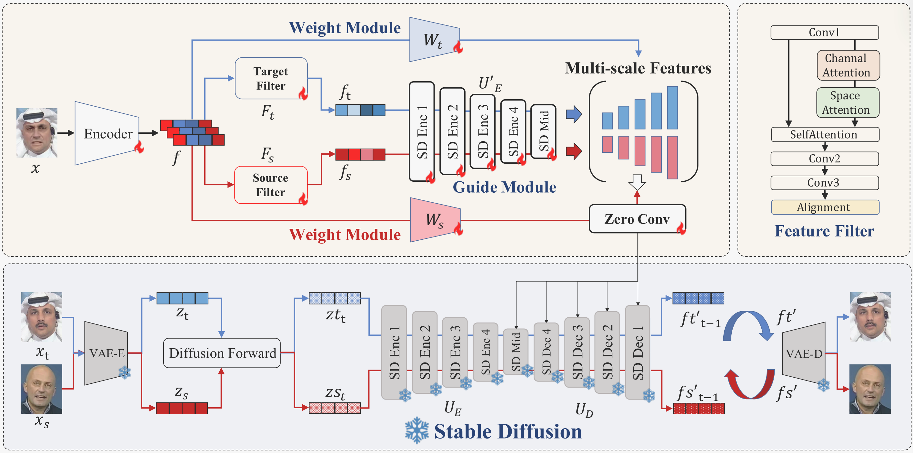

### DiffusionFake Framework 阅读笔记

**==DiffusionFake- Enhancing Generalization in Deepfake Detection via Guided Stable Diffusion==**

通过使用一个非常牛逼的好模型（Stable-Diffusion）来指导 BackBone 的模型提取图像特征，在这篇文章中，Feature-moudle、Weight-module 和 Guide-moudle 共同提高 encoder 和 classfier 的能力。

**Weight-moudle**

使用的是 weight module，对 encoder 提取出的Target 特征和 Source 特征动态调整二者对最终特征提取的权重， VAE-E 模块对伪造图像、源图像和目标图像编码后得到特征，然后分别计算 z 与 z_t 和 z_s的相似度，作为 weight-module 的标签，这个 idea 值得借鉴。

Guide-moudle

在这篇工作中，指导模块与冻结的 stable-diffution 模块的编码器结构相同，Feature-moudle、Weight-module 和 Guide-moudle 共同提高 encoder 和 classfier 的能力。

指导模块使用的特征如下：把 encoder 提取出的特征给到目标和源过滤器过滤，然后将过滤后的特征分别给到指导模块的编码器进行编码然后输入到零卷积层，随后将两个特征与 weight-module 给到的权重乘积得到最终 guide module 提取得到的特征。

**Stable-Diffuison**

VAE 模块对两个图像（源图像和目标图像）提取后的特征输入给 Stable-Diffusion 的编码器，再输入解码器得到潜在特征。

Stable-Diffusion 与 Guide-module 提取的特征合并作为后续生成源图像和目标图像的真正 Laten-information。

怎样评价扩散模型生成的源图和目标图：使用的是 LDM 的训练方式，预先计算对原图加入的噪声作为扩散模型训练的标签， VAE-D 对 Guide-module 和 VAE-E 结合的特征进行解码预测噪声，二者计算损失，反向梯度传播。

### 成效

结果：Feature-filter（Target-filter&Source-filter）更能剥离Encoder 的特征；Weight-module 更能为源图像和目标图像作动态权重划分；指导模型更能够提取和总结上述特征并与 Stable-diffusion 共同生成源图像和目标图像。

上述的结果是文章提出的 DiffusionFake 框架在训练后得到的效果，但一切都是为了提升 Encoder 对伪造图像提取出其中的源图像与目标图像之间的不可见特征（原因在于梯度传播，使得 Encoder 借助了非常强大的预训练 Stable-Diffuion 模型的能力去进行训练，有点蒸馏模型的意思）和分类头的分类效果。

上述就是这篇文献的核心思想，通过借助了 Stable-Diffusion 和 DiffusionFake 框架训练好了 Encoder，进而使得模型获得了大量先验知识，使得其在最后推理过程中代价变低（DeepSeek？）

---

**可改进的点**：

1. Weight-Module 是否可以不输出一个值，而是一个矩阵；

2. 换一个更牛的扩散模型？

3. Encoder、Feature-Moudle、Weight-Moudle、Guide-Module 的结构？